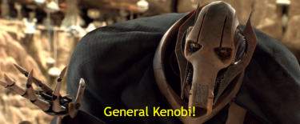

# Hello there



## I'm Peter - aka Damblor

### Fourth-year computer science student

## About me

I create useless projects that I abandon after 2 weeks. Besides, I love books, manga, the Star Wars universe and Asian food. I started my IT adventure with programming, but for some time now I've been more interested in the topic of cyber security. I'm also a big fan of strategy games, especially Hearts of Iron IV and chess.

```text
🌱 I'm currently learning Blazor and Norwegian
💬 Quote: It only becomes a mistake when you fail to correct it - Grand Admiral Thrawn
📚 Favourite book series: Stormlight Archive and The Witcher
⚡ Fun fact: Honeybees navigate using the sun as their compass
```

## Skills

### Languages

```text
Polish (native) | English (fluent)
```

### Programming languages

```text
C# | Python | JavaScript/TypeScript | C/C++
```

### Frameworks

```text
.NET Core | ASP.NET Core | Entity Framework Core | Blazor | .NET MAUI
```

### Tools

```text
Git | Visual Studio | Visual Studio Code | Docker | Jenkins | Blender | JetBrains IDEs | STM32CubeIDE/STM32CubeMX
```

### Other

```text
LaTeX | Markdown | HTML | CSS | SQL | Bash | Powershell
```


